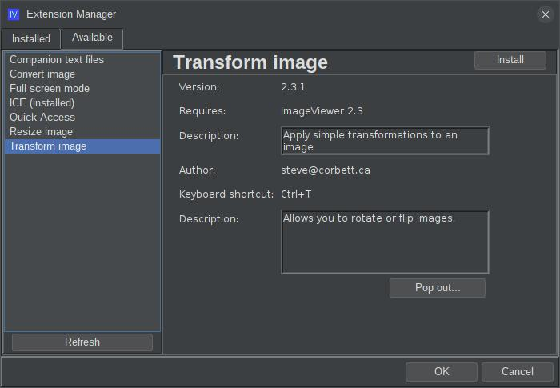

# ext-iv-image-transform

## What is this?

This is an extension for ImageViewer for performing image transformations such as rotate or flip.

## How do I get it?

### Option 1: automatic download and install

**New!** Starting with the 2.3 release of ImageViewer, you no longer need to manually build and install application extensions!
Now, you can visit the "Available" tab of the new and improved extension manager dialog:



Select "Transform image" from the menu in the left and hit the "Install" button in the top right. If you decide
later to remove the extension, come back to the extension manager dialog, select "Transform image" from the 
list on the left, and hit the "Uninstall" button in the top right. The application will prompt to restart.
It's just that easy!

### Option 2: manual download and install

You can manually download the extension jar: 
[ext-iv-image-resize-2.3.0.jar](http://www.corbett.ca/apps/ImageViewer/extensions/2.3/ext-iv-image-resize-2.3.0.jar)

Save it to your ~/.ImageViewer/extensions directory and restart the application.

### Option 3: build from source

You can clone this repo and build the extension jar with Maven (Java 17 or higher required):

```shell
git clone https://github.com/scorbo2/ext-iv-image-transform.git
cd ext-iv-image-transform
mvn package

# Copy the result to extensions dir:
cp target/ext-iv-image-transform-2.3.0.jar ~/.ImageViewer/extensions/
```

## Okay, it's installed, now how do I use it?

Once ImageViewer is restarted, you can hit Ctrl+T or select "Transform image" from the "Edit" menu:


## Requirements

ImageViewer 2.3 or higher.

## License

Imageviewer and this extension are made available under the MIT license: https://opensource.org/license/mit