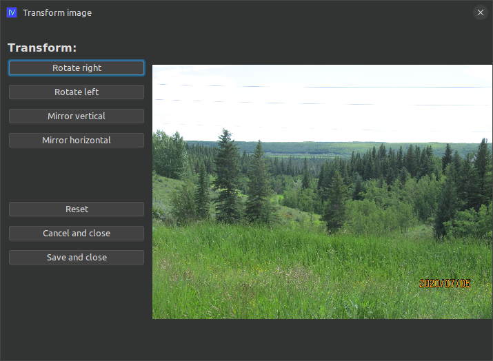

# ext-iv-image-transform

## What is this?

This is an extension for ImageViewer for performing image transformations such as rotate or flip.

### How do I use it?

Clone the repo and build the extension jar with maven:

```shell
git clone https://github.com/scorbo2/ext-iv-image-transform.git
cd ext-iv-image-transform
mvn package
```

Now you can copy the extension jar to wherever you keep your imageviewer extensions:

```shell
cp target/ext-iv-image-transform-2.3.0.jar ~/.ImageViewer/extensions/
```

Now restart imageviewer and hit Ctrl+T or select "Transform image" from the "Edit" menu:



### Requirements

ImageViewer 2.3 or higher.

### License

Imageviewer and this extension are made available under the MIT license: https://opensource.org/license/mit